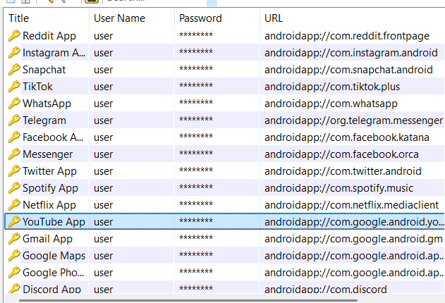
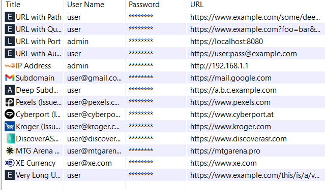
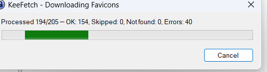

# KeeFetch

[](https://github.com/tzii/KeeFetch/actions)
[](https://github.com/tzii/KeeFetch/releases)
[](https://opensource.org/licenses/MIT)

A fast, smart, and modern favicon downloader plugin for KeePass 2.x.


## 📸 Screenshots

| Android Support | High Quality Icons | Progress Dialog |
|:---:|:---:|:---:|
|  |  |  |

## ✨ Features

- **Concurrent downloads** — Parallel favicon fetching using `SemaphoreSlim` to keep the UI responsive.
- **Smart icon detection** — Prioritizes `apple-touch-icon`, parses modern `sizes` attributes, and detects high-resolution candidates.
- **Robust fallback chain** — Direct site → Google → DuckDuckGo → Icon Horse → Yandex.
- **Deduplication** — SHA-256 hashing ensures icons aren't duplicated in your database.
- **Android Support** — Converts `androidapp://` URLs to web domains with 100+ built-in mappings and Play Store scraping.
- **Intelligent URL handling** — Resolves KeePass `{REF:...}` placeholders and auto-prefixes schemes.
- **Modern Standards** — Supports TLS 1.3, respects KeePass proxy settings, and handles self-signed certificates.

## 🚀 Installation

### Quick Install (Recommended)

1. Download `KeeFetch.plgx` from the [latest release](https://github.com/tzii/KeeFetch/releases/latest).
2. Copy the file into your KeePass `Plugins` folder:
   - **Portable**: `KeePass/Plugins/`
   - **Installed**: `%ProgramFiles%/KeePass Password Safe 2/Plugins/`
3. Restart KeePass.

## 🛠 Usage

| Action | Location |
|:---:|:---|
| **Single Entry** | Right-click entry → **KeeFetch - Download Favicons** |
| **Entire Group** | Right-click group → **KeeFetch - Download Favicons** |
| **All Entries** | **Tools** → **KeeFetch** → **Download All Favicons** |
| **Settings** | **Tools** → **KeeFetch** → **Settings...** |

## 🏗 Building from Source

KeeFetch uses an SDK-style project for development and a legacy-style project for PLGX compatibility.

### Prerequisites
- Visual Studio 2022 or .NET 8 SDK
- .NET Framework 4.8 Targeting Pack
- KeePass 2.x (installed for PLGX creation)

### Build Commands
```powershell
# Build the DLL and run tests
dotnet build
dotnet test

# Create PLGX (requires KeePass.exe in Path)
KeePass.exe --plgx-create "path\to\KeeFetch"
```

## 📖 Architecture

KeeFetch is designed with a **provider-based fallback strategy**. It first attempts to parse the website directly to find the highest quality icon (looking for `apple-touch-icon` or large PNGs). If that fails, it cycles through multiple specialized favicon services until an icon is found or all sources are exhausted.

For a deep dive into the code, see our [Project Structure](CONTRIBUTING.md#project-structure) in the contribution guide.

## 🤝 Contributing

Contributions are what make the open source community such an amazing place to learn, inspire, and create. Any contributions you make are **greatly appreciated**.

Please see [CONTRIBUTING.md](CONTRIBUTING.md) for details on our code of conduct and the process for submitting pull requests.

## ⚖️ License

Distributed under the MIT License. See `LICENSE` for more information.

## 🙏 Acknowledgments

- [KeePass Password Safe](https://keepass.info/) — The ultimate password manager.
- Inspired by [KeePass-Yet-Another-Favicon-Downloader](https://github.com/navossoc/KeePass-Yet-Another-Favicon-Downloader) — The original favicon downloader plugin that inspired this project.
- [Icon Horse](https://icon.horse/), [DuckDuckGo](https://duckduckgo.com/), [Google](https://google.com), and [Yandex](https://yandex.com) for their favicon APIs.
