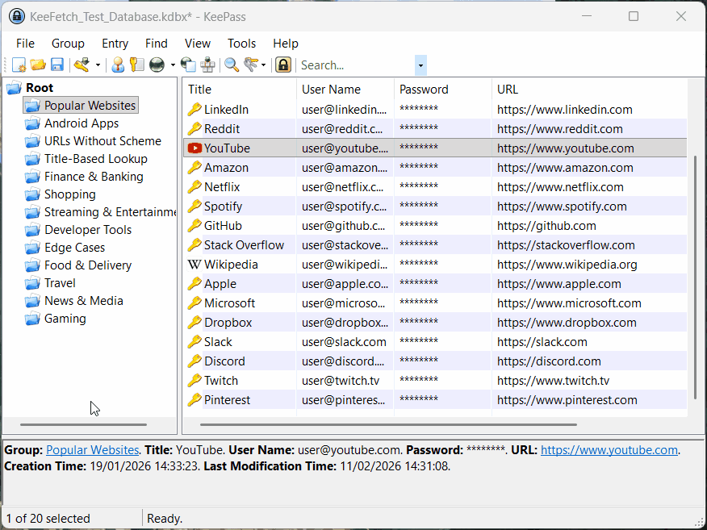
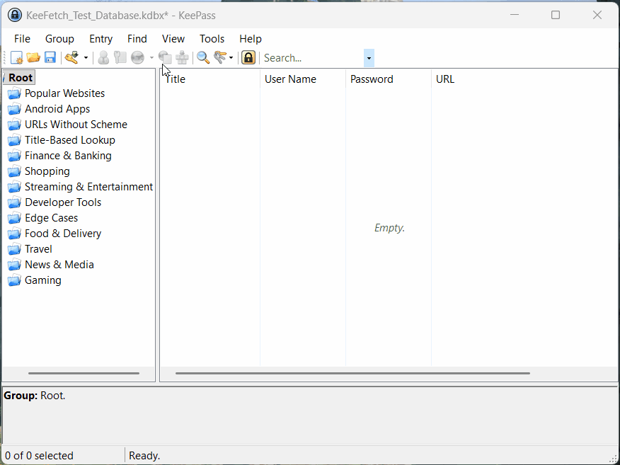
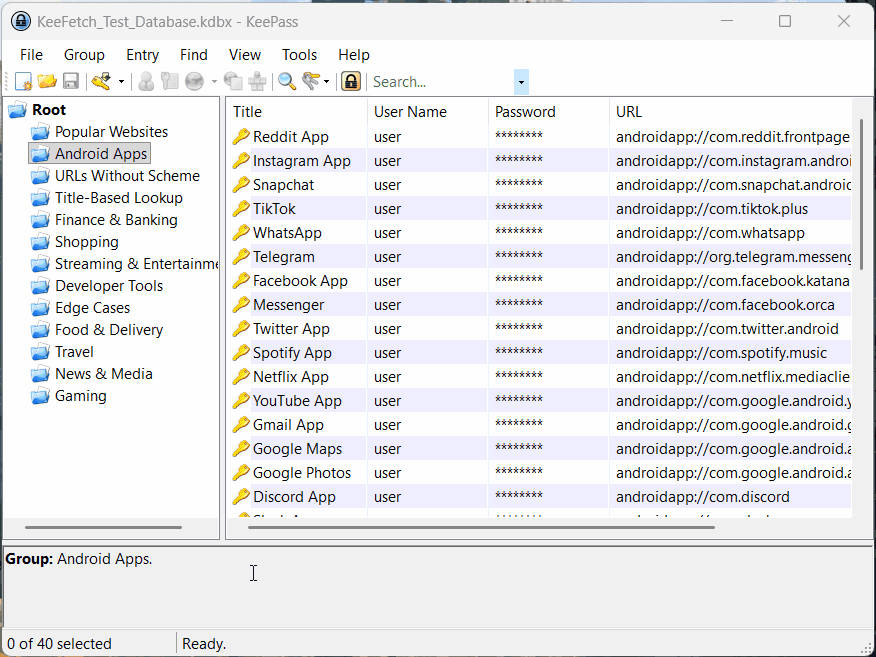
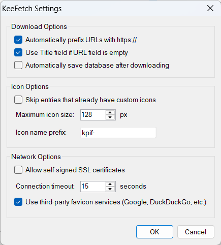

# KeeFetch

[](https://github.com/tzii/KeeFetch/actions)
[](https://github.com/tzii/KeeFetch/releases)
[](https://opensource.org/licenses/MIT)

A fast, smart, and modern favicon downloader plugin for KeePass 2.x.


## ✨ Features

- **Concurrent downloads** — Parallel favicon fetching using `SemaphoreSlim` to keep the UI responsive.
- **Availability-first selector engine** — Collects provider candidates, then ranks by trust tier (`Site canonical` → `Strong resolver` → `Synthetic fallback`) so placeholder-prone results cannot outrank stronger real icons.
- **Smart icon detection** — Parses `rel=icon`, `apple-touch-icon`, `rel=manifest` icon entries, and detects SVG-only situations for resolver fallback competition.
- **Expanded fallback chain** — Direct site → Twenty Icons → DuckDuckGo → Google → Yandex → Favicone → Icon Horse.
- **Deduplication** — SHA-256 hashing ensures icons aren't duplicated in your database.
- **Android Support** — Converts `androidapp://` URLs to web domains with 100+ built-in mappings and Play Store scraping.
- **Intelligent URL handling** — Resolves KeePass `{REF:...}` placeholders and auto-prefixes schemes.
- **Modern Standards** — Supports TLS 1.3, uses the system default proxy configuration, and handles self-signed certificates.

## 🔒 Privacy

By default, KeeFetch uses third-party favicon services (Twenty Icons, DuckDuckGo, Google, Yandex, Favicone, Icon Horse) as fallbacks when direct site fetching is insufficient. Domain names from your password entries may be sent to these services to maximize icon availability.

KeeFetch shows a one-time first-run disclosure about this behavior and keeps the availability-first defaults enabled. You can still disable third-party providers, synthetic fallbacks, or specific resolvers in plugin settings (`Tools` → `KeeFetch` → `Settings...`).

## 🚀 Installation

### Quick Install (Recommended)

1. Download `KeeFetch.plgx` from the [latest release](https://github.com/tzii/KeeFetch/releases/latest).
2. Copy the file into your KeePass `Plugins` folder:
   - **Portable**: `KeePass/Plugins/`
   - **Installed**: `%ProgramFiles%/KeePass Password Safe 2/Plugins/`
3. Restart KeePass.

## 🛠 Usage & Demo

### 1. Simple One-Click Fetch

Right-click any entry and select **KeeFetch - Download Favicons**. The plugin will instantly search for the best icon, prioritizing high-resolution sources like `apple-touch-icon` and large PNGs.


*Right-click any entry to instantly fetch its favicon*

### 2. Bulk Group Processing

Process entire groups (including all subgroups) in one go. KeeFetch uses a concurrent engine with `SemaphoreSlim` for up to 8 parallel downloads, so fetching 100+ icons only takes seconds.


*Process entire groups with concurrent downloads*

### 3. Android App Support

KeeFetch uniquely handles `androidapp://` URLs. It maps package names (like `com.instagram.android`) to official web domains using a built-in database of 100+ app mappings, with Google Play Store fallback.


*Automatic androidapp:// URL to web domain mapping*

### 4. Database-wide Maintenance

Keep your entire database up to date via the Tools menu. Perfect for cleaning up missing icons in large, existing databases.


*Update all entries across your entire database*

**Menu Path:** `Tools` → `KeeFetch` → `Download All Favicons`

> **💡 Tip:** Configure KeeFetch to skip entries that already have custom icons in **Settings** (`Tools` → `KeeFetch` → `Settings...`).

## 🏗 Building from Source

KeeFetch uses an SDK-style project for development and a legacy-style project for PLGX compatibility.

### Prerequisites
- Visual Studio 2022 or .NET 8 SDK
- .NET Framework 4.8 Targeting Pack
- KeePass 2.x (installed for PLGX creation)

### Build Commands
```powershell
# Build the DLL and run tests
dotnet build
dotnet test

# Create PLGX (requires KeePass.exe in Path)
KeePass.exe --plgx-create "path\to\KeeFetch"
```

## 📖 Architecture

KeeFetch is designed with an **availability-first ranked selection strategy**. Providers return structured candidates with tier and confidence metadata. The selector then chooses the best surviving candidate, ensuring synthetic fallback providers only win when no stronger site-backed or resolver-backed icon survives.

For a deep dive into the code, see our [Project Structure](CONTRIBUTING.md#project-structure) in the contribution guide.

## 🤝 Contributing

Contributions are what make the open source community such an amazing place to learn, inspire, and create. Any contributions you make are **greatly appreciated**.

Please see [CONTRIBUTING.md](CONTRIBUTING.md) for guidelines and the process for submitting pull requests.

## ⚖️ License

Distributed under the MIT License. See `LICENSE` for more information.

## 🙏 Acknowledgments

- [KeePass Password Safe](https://keepass.info/) — The ultimate password manager.
- Inspired by [KeePass-Yet-Another-Favicon-Downloader](https://github.com/navossoc/KeePass-Yet-Another-Favicon-Downloader) — The original favicon downloader plugin that inspired this project.
- [Twenty Icons](https://twenty-icons.com/), [DuckDuckGo](https://duckduckgo.com/), [Google](https://google.com), [Yandex](https://yandex.com), [Favicone](https://favicone.com/), and [Icon Horse](https://icon.horse/) for favicon APIs.
