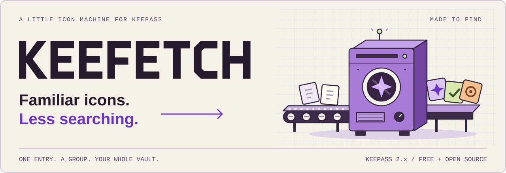
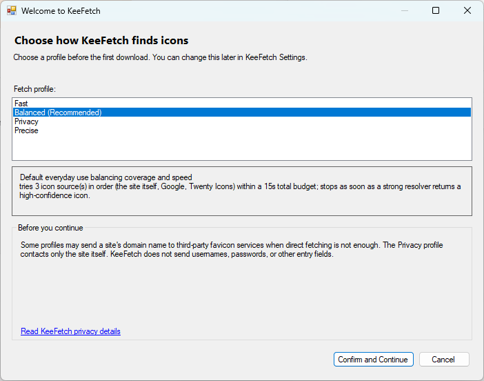
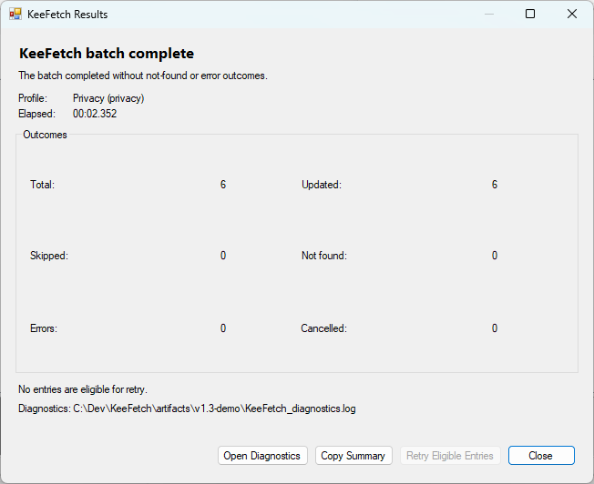
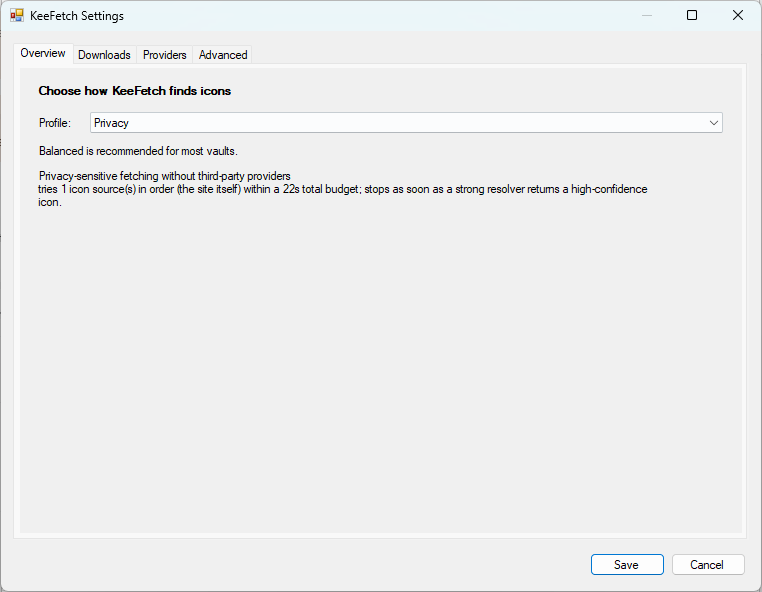
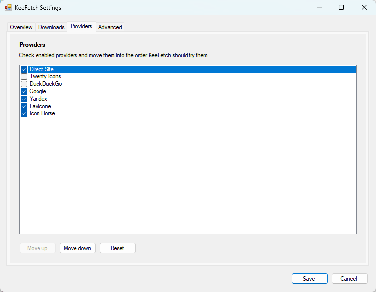

[](https://tzii.github.io/KeeFetch/)

# KeeFetch

**Give your KeePass entries their website icons.** Fetch an icon for one entry, a whole group, or your database, with control over which services are contacted.

[](https://github.com/tzii/KeeFetch/actions/workflows/build.yml) [](https://github.com/tzii/KeeFetch/releases/latest) [](LICENSE)

**[Download KeeFetch](https://github.com/tzii/KeeFetch/releases/latest)** · **[Website](https://tzii.github.io/KeeFetch/)** · **[Getting started](https://tzii.github.io/KeeFetch/getting-started.html)** · **[Release notes](CHANGELOG.md)**

For **KeePass 2.x on Windows** with **.NET Framework 4.8**. Free and open source. No account or telemetry. KeePassXC is not supported.

## Install in a minute

1. Download **`KeeFetch.plgx`** from the [latest stable release](https://github.com/tzii/KeeFetch/releases/latest). Checksums and the alternative DLL are included there.
2. Close KeePass and copy the file into its **`Plugins`** folder. For a portable installation, this is next to `KeePass.exe`; for an installed copy, it is usually `%ProgramFiles%\KeePass Password Safe 2\Plugins`.
3. Start KeePass. Right-click an entry and choose **KeeFetch - Download Favicons**. On the first download, choose a profile; **Balanced** is the default.

Keep only **one** plugin format installed: PLGX or DLL. Before upgrading or fetching icons across a database, make a database backup. Replacing the plugin does not undo icon changes; restoring a backup does. See the [installation and upgrade guide](https://tzii.github.io/KeeFetch/getting-started.html).

## A small plugin that does the sorting

- **One entry or the whole vault.** Fetch from entry and group context menus, or use **Tools → KeeFetch → Download All Favicons**. Groups can include their subgroups.
- **Your providers, your choice.** Four ready-made profiles, plus Custom settings for provider order, timeouts and fallbacks.
- **Better candidates, fewer duplicates.** Looks for site icons and web manifests, ranks candidates by source and confidence, and deduplicates identical image bytes.
- **Android links included.** Resolves `androidapp://` package names through 100+ built-in mappings and, when enabled, Google Play lookup.
- **Results you can act on.** See updated, skipped, missing, error and cancelled counts; copy a summary, inspect diagnostics, or retry eligible entries once.

Open **Tools → KeeFetch → Settings...** to change profiles, adjust downloads, reorder providers, or skip entries that already have custom icons.

## See it in KeePass

Actual **v1.3** captures, shared with the [website screenshot gallery](https://tzii.github.io/KeeFetch/#screenshots).

### Choose a profile on the first run



### Check the result



This six-entry demonstration completed successfully using Privacy. It illustrates the results screen; coverage and timing depend on the entries, profile and network.

<details>
<summary><strong>Settings: overview and providers</strong></summary>

The Overview tab selects a profile. The Providers tab shows the provider controls used when configuring Custom.





</details>

<details>
<summary><strong>Earlier demos — GIF refresh planned</strong></summary>

These recordings show an older interface. The v1.3 screenshots above show the current first-run and completion dialogs. The original GIFs are kept here until they are re-recorded.

**Fetch for one entry**


**Fetch for a group**


**Resolve an Android app link**


**Run database-wide maintenance**


</details>

## Choose how icons are fetched

| Profile | Sources, in order | Total budget | Best fit |
| --- | --- | --- | --- |
| **Fast** | Direct Site → Yandex | 22 s | Lowest measured eligible cold-batch duration in the study. |
| **Balanced** (default) | Direct Site → Google → Twenty Icons | 15 s | Everyday balance of reviewed usability, coverage and speed. |
| **Privacy** | Direct Site | 22 s | Disables favicon resolvers and Google Play lookup. |
| **Precise** | Direct Site → Google | 22 s | Prioritizes reviewed usability among returned icons; see the scoring caveat below. |
| **Custom** | Your choice and order | Configurable | Manual control over all seven providers and timeouts. |

Budgets are upper bounds per fetch, not expected batch durations. A larger budget does not mean Fast was slower in the study. Fast, Balanced and Precise stop at a strong resolver hit; managed profiles disable synthetic fallbacks.

The profiles come from the [19-candidate provider study](docs/benchmarks/v1.3-provider-study.md), using 827 machine-reviewed units. Four unresolved app identities count as failures under the disclosed conservative policy; **Precise's winning configuration changes with that scoring choice**. These are measured tradeoffs, not a guarantee of perfect icons. [Compare profiles and providers](https://tzii.github.io/KeeFetch/profiles.html).

## Know where requests go

**Balanced and other resolver-enabled profiles can share entry domains with third-party favicon services.** KeeFetch does not send usernames or passwords and has no telemetry. The first-run dialog explains this before downloading.

**Privacy disables favicon resolvers and Google Play lookup.** Direct Site still follows redirects and site-linked icons or manifests, including those hosted elsewhere. It is not a same-origin network policy.

Recognized private hosts are excluded from resolver lookups, and resolver redirects to recognized private hosts are refused before contact. This uses a lexical classifier: it does not detect every internal DNS name or validate DNS answers. Direct Site can contact private hosts.

**Diagnostics contain entry titles and resolved URLs in plaintext.** Log and CSV files are written beside the database when possible, otherwise to a temporary directory. Privacy does not redact them; review and redact diagnostics before sharing.

Read the [privacy and network details](https://tzii.github.io/KeeFetch/privacy.html) for provider endpoints, Android lookup, redirects and certificate handling.

## Help and development

- **Installation, missing icons or retries:** [Troubleshooting](https://tzii.github.io/KeeFetch/troubleshooting.html).
- **Bugs and feature requests:** [GitHub issues](https://github.com/tzii/KeeFetch/issues). Include the KeePass/KeeFetch versions, selected profile and steps to reproduce. Remove private data from any attachments.
- **Code and documentation changes:** [Contributing](CONTRIBUTING.md), including architecture, PLGX packaging and all repository checks.
- **Release evidence and study records:** [Documentation index](docs/README.md).

### Build from source

Use Windows, the .NET 8 SDK, the .NET Framework 4.8 targeting pack and KeePass 2.x. Set `KeePassPath` to the directory containing `KeePass.exe`:

```powershell
dotnet build KeeFetch.sln -c Release -p:KeePassPath="C:\path\to\KeePass" -warnaserror
dotnet test KeeFetch.Tests/KeeFetch.Tests.csproj -c Release --no-build
```

The plugin targets .NET Framework 4.8. Production source stays compatible with C# 5 so KeePass can compile the PLGX; the test project uses C# 7.3. See [the contributor guide](CONTRIBUTING.md#development-environment) for packaging and verification commands.

## License and credits

[MIT licensed](LICENSE). Built for [KeePass Password Safe](https://keepass.info/) and inspired by [KeePass-Yet-Another-Favicon-Downloader](https://github.com/navossoc/KeePass-Yet-Another-Favicon-Downloader).

Thanks to [Twenty Icons](https://twenty-icons.com/), [DuckDuckGo](https://duckduckgo.com/), [Google](https://google.com/), [Yandex](https://yandex.com/), [Favicone](https://favicone.com/) and [Icon Horse](https://icon.horse/) for their favicon services.
